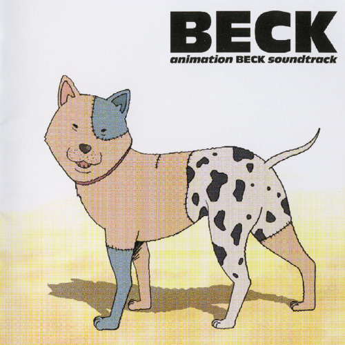
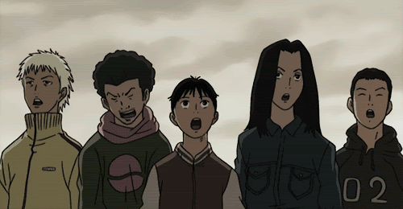
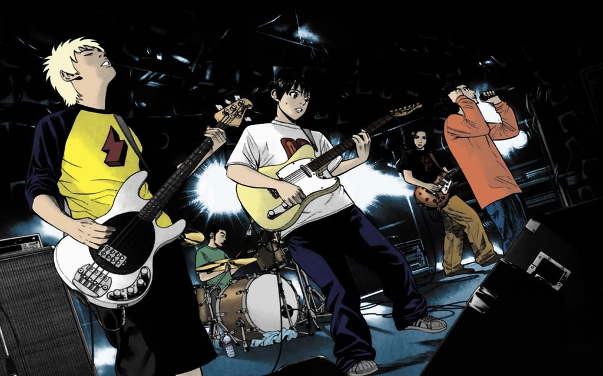
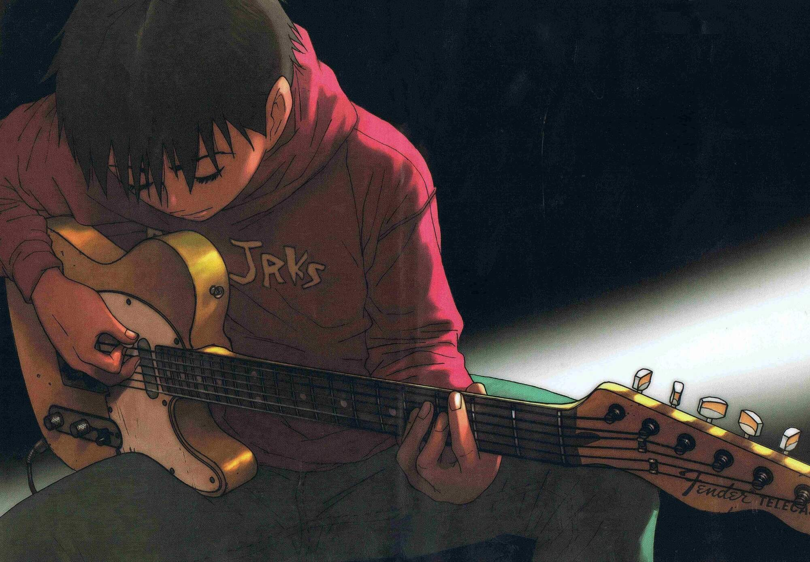

+++
title= "Why 'BECK: Mongolian Chop Squad' is Worth Your Time"
date = '2025-05-07T10:38:03-04:00'
draft= false
categories= ["published"]
tags= ["anime", "beck", "manga"]
coverAlt= "A manga panel from *BECK* by Harold Sakuishi"
coverCaption= "A manga panel from *BECK* by Harold Sakuishi"
summary = "My plea to lure you to a series that I hold dear."
+++

# What's This All About?

'***BECK: Mongolian Chop Squad***', also known just as "***BECK***" is a manga series written by Harold Sakuishi that ran from 1999 to 2008. It consisted of 34 published volumes, of which only 12 have been published physically in English (😞). 

It is surprisingly not about the already famous musician, Beck, of '*Loser*' fame.

The series is a coming-of-age story that is centered around music.

The story centers on Yukio "Koyuki" Tanaka, a 14-year-old boy living a mundane life until he meets Ryusuke Minami, a talented guitarist with a mysterious past (that we learn more about as the series progresses). Ryusuke introduces Koyuki to the world of rock music and recruits him into his newly formed band, BECK, named after his funny looking dog (shown below):

As Koyuki learns to play the guitar and develops his voice, the band begins to gain attention from both the audiences and their peers. The series showcases BECK’s journey as a band and Koyuki's journey as a teenager, highlighting the challenges they face—industry politics, personal conflicts, and love interests (notably Koyuki's crush on Ryusuke’s sister, Maho).

The series was adopted into an anime in 2004 in Japan, and finally aired in the US in 2007.

Oh... and at some point in the story, you'll learn about how the "*Mongolian Chop Squad*" part of the name comes into play!

---------------

# My Journey With BECK

My first introduction to *BECK* was by watching the anime.

I first watched *BECK* at a low-ish point in my life a few years ago. It was shortly after I had moved across the country to live with my girlfriend and to finally start my career post-college.

Truthfully, I was ready to make the jump for numerous reasons and I wasn't really all that worried about any aspect related to the move and my new life in a new state.

Things were actually going very well for me aside from some nagging health issues that began to kind of consume my daily life and my thoughts (anxious over-thinker, here). I won't dive into those details here, don't worry.

Let's get back on track.

I was searching for a new anime to watch when I decided I really wanted to see if there were any music related series. Of course, I came across some that I had heard about many times like '*FLCL*' and the likes. But for the first time, I came across *BECK*. I knew immediately that I had to watch it.

THAT INTRO! What a unique intro with such a great song. I was hooked from the first time I heard/saw it. Check it out below:



Within the course of 48-72 hours, I had watched the entire 26 episode series (in English dub).

It **immediately** rose to the top of my anime list to become my #1 favorite anime that I had seen so far. I truly felt like I hadn't connected to a piece of media or a story aas much as I had with *BECK*.

*BECK* was on my mind constantly for the next several weeks. Near the end of that complete mind consuming era, I had found out the anime wasn't the end! The series had not been fully adapated within the anime and there was still so so so much more to discover by picking up the manga where the series left off.

So.. that's exactly what I did. I began reading the manga beginnning at the chapter where the anime left off!

I began 3-4 volumes a day, every day. There were several moments where I found myself so engrossed in this world, this band, these characters, this setting that I had to remember that none of this was real.. haha.

Adapting to the manga coming from the anime was tough, but listening to the anime soundtrack throughout my reading time greatly enhanced the story and allowed me to easily feel the same connection that I had with the anime.

Some of my favorite songs include:
- [Baby Star](https://www.youtube.com/watch?v=N9W2b7DlMVo&pp=ygUOYmVjayBiYWJ5IHN0YXI%3D) (!!)
- [Face](https://www.youtube.com/watch?v=dLwjUJ6AhIc&pp=ygUJYmVjayBmYWNl)
- [Moon on the Water](https://www.youtube.com/watch?v=B5xZ-Qw9nE0&pp=ygUWYmVjayBtb29uIG9uIHRoZSB3YXRlcg%3D%3D) 
- [Follow Me](https://www.youtube.com/watch?v=bNM7mU7nUao&pp=ygUOYmVjayBmb2xsb3cgbWU%3D)
- [Slip Out](https://www.youtube.com/watch?v=WN2etQ7XDkM&pp=ygUNYmVjayBzbGlwIG91dA%3D%3D)
- [Brainstorm](https://www.youtube.com/watch?v=TL6KJFgRGK4&pp=ygUPYmVjayBicmFpbnN0b3Jt)

As the story began to develop and expand far further than I could have even imagined after watching the anime, I just got more and more invested in it. It went so much further than I would have expected for what I once thought was a one-off season anime series. By the end of the series, 5 years had passed and Koyuki was about to reach his 20s.

Finally the day came where I reached Volume 34, the final volume. I'll try my best to not bore you with excessive details and will just say I was definitely crying by the last page. When I turned to the final panel and fully analyzed it, all it did was just leave me wanting **more**. These characters had become a part of my life and to have their story just come to an end, against my will (!) it was hard to grasp. Especially with how the story is framed in that final panel, the reader knows there is more to come and so many more journeys and developments that will happen in the journey of this band. Not being able to join them on that journey was really tough to accept.

Ultimately, after some time to digest it, I really did love the ending and the way that Sakuishi framed then ending. It was one of the first times I really enjoyed an open-ended finale.

---------------

# Why You Should Check It Out

Um... you thought I was going to end this blog post with some long spiel, pleading you to go pickup the manga or go watch the anime online?

**NO!**

If you have read this far and still don't even feel slighlty inclined to check it out, then there are 2 possibilites:
1. I suck at writing 😅
2. You have no soul 👻

Honestly, it's more than likely the first option. I've never considered myself to be a great writer, but I hope that writing about something I'm very passionate about and care deeply about brings out that writer side of me enough to convince at least one person to give this story a chance. Whether it be via the Anime or the Manga, or both, you really can't go wrong when checking this series out.

You don't even have to be "into music" or Rock to appreciate how well-written this story is and how I'm sure that it could change your life!

If I accomplish one thing with this blog, I wouldn't even mind if that one thing is introducing this to one of you.

Also, [follow me on AniList!](https://anilist.co/user/itsgoodtobefree/) to stay up-to-date on my anime watching and manga reading journey. I'd be happy to follow back.

*This is my first "true" blog post, so please forgive me if the writing is a bit off or it wasn't all that interesting or presented in an interesting matter. This is my first attempt at writing narratively since college (going on 5 years since my graduation, even longer since I had to write creatively). I hope to find my stride in writing blogs and develop this craft until I'm happy with every post. I also wrote this without any outline or pre-planning. Just off the top of my head.*

## *Thanks for reading, and enjoy!* 😃🤘